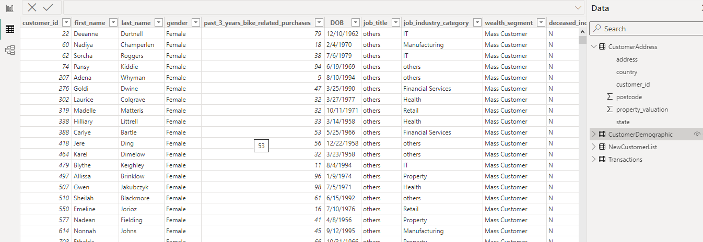
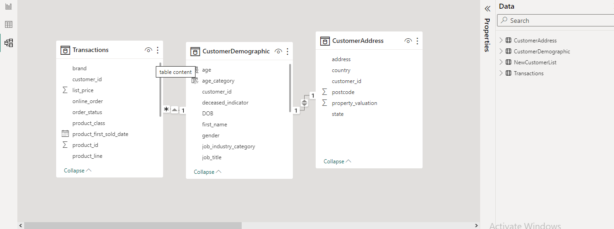
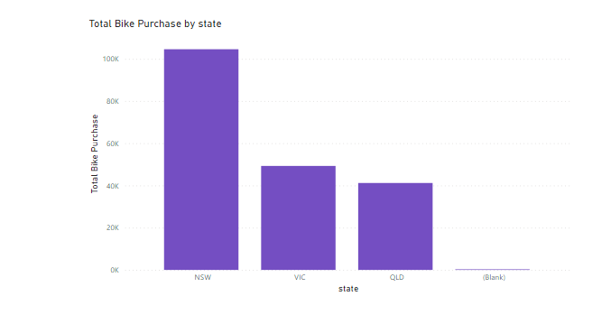
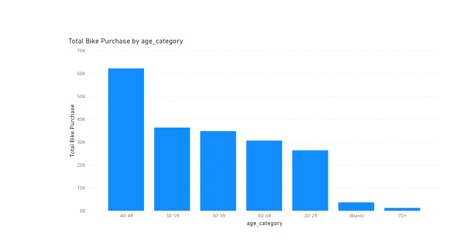
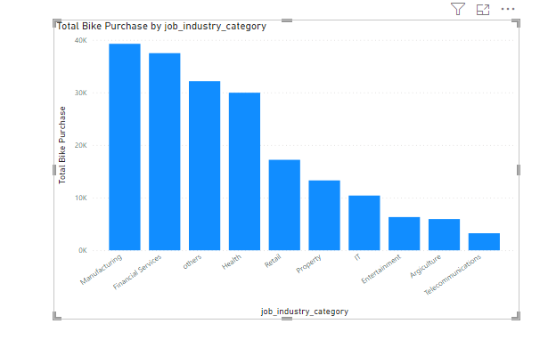
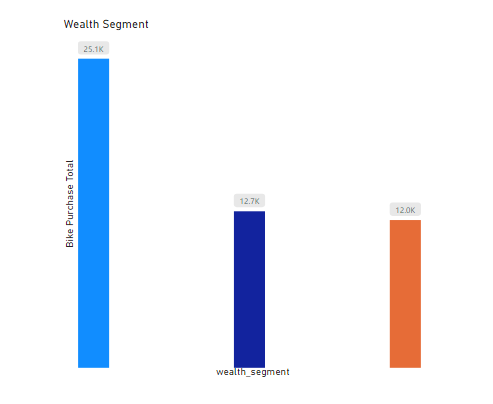
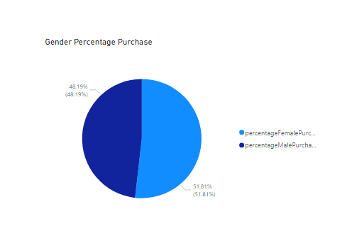
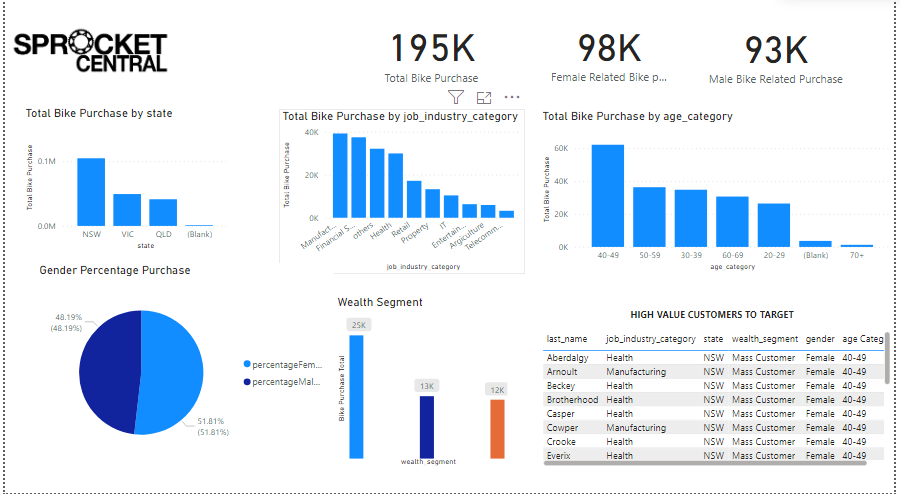
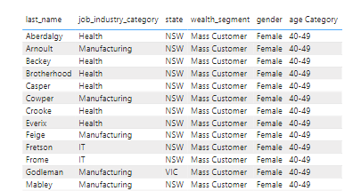

# CUSTOMER_DESCRIPTIVE_ANALYSIS

### Introduction
Our client Sprokket central pty Ltd is a household name in the retail (Bike) business 
in Australlia. Theyre looking to expand their business and maximise profit accross demographics,
industries etc.

### Problem Statement
Sprocket central seeks to understand and identify which of its 1000 new customers it should target and deploy all its marketing 
resources on, Based on existing data on its old and new customers.
After deep analytical thinking and consideratoin we came up with the following questions

1.  Which States was bikes purchase the highest and most frequent?
2.  Which Gender purchased bikes the most?
3.  Which age category makes the highest purchase?
4.  Which job industry's is bike purchase most frequent?
5.  Which wealth segmentation patronize bike sproket the most?
   

### Data Sourcing
Dataset was provided by our client in excel format and meets all licensisng, privacy, security standards and regulations.
The dataset contains four excel sheets which includes:
1.  TitleSheet (Meta data...instructions on how to navigate the dataset)
2.  CustomerDemographics
3.  NewCustomerList
4.  Transactions
5.  CustomerAddress

Link to dataset.

### Data Preprocessing/ Cleaning

Created the age column in the customerDemographics dataset using the excel DATEDIF function,
and also used excel VLOOKUP function to get the profits of the customers based on customer's id.

Imported dataset into power query in Power BI for futher wrangling and transformation.

The following process where carried out on dataset to clean the dataset:

1.  In the customerDemographics dataset:
    The default column was removed.
    Empty fields and blanks from the DOB column was removed.
    An outlier in the DOB column was renoved.
    Fields marked yes in the deceased column was removed.
    Gender coulumn was made consistent by ensuring it was limited to just "MALE", "FEMALE", "U"

2.  In the CustomerAddress dataset:
      The state of New South Wales  Victoria was replaced with NSW and VIC respectively.

3. In the Transactions dataset:
     A calculated column named profit was created.

Below is a screenshot of the power BI tables

### Models
The following tables where joined based on the customer id.
1.  customerDemographic
2.  customerAddress.
3.  Transactions

Below is a screenshot of the model

### Analysis and Visualization

Analysis was done using simple visuals since the tables have been perfectly modelled together.

#### Total bike purchase by states

The highest bike purchases is made in the state of NSW. purchases of over 100,000

#### Total bike purchase by age category

The highest number of bikes is being purchased by the age group 40-49.

#### Job industry purchases

Purchases are very high within the Manufacturing, Healthcare and IT industry's

#### Purchaeses by wealth segment

The Mass customers are making the highest purchases.

#### Gender percentage

Apparently females hold a larger share of the bike purchase market

#### DASHBOARD TO VISUALIZE OUR FINDINGS

Apparently females hold a larger share of the bike purchase market

### Conclusion/Recommendation

Based on these findings we where able to identify the customers to target from our newcustomers dataset, based on their 
state,gender, wealth segment, age_category and the industry they work.

Hence we came up with this list.

Sproket Central should deploy all its marketing resources to target these high value customers.

   

